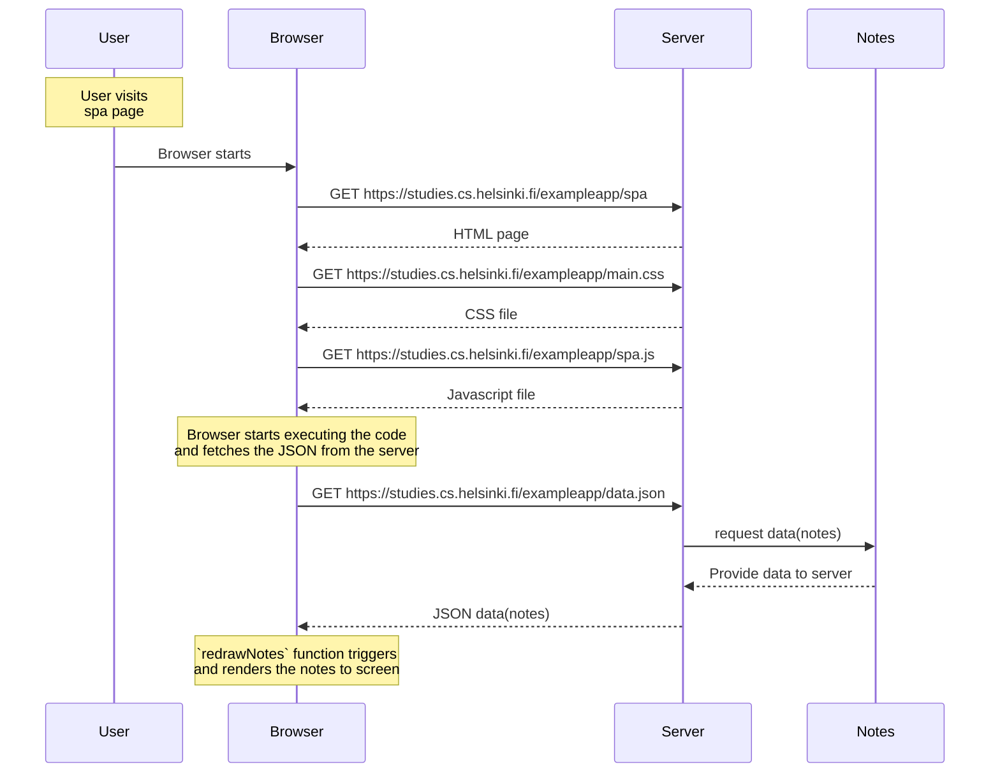

```mermaid
sequenceDiagram
    participant U as User
    participant B as Browser
    participant S as Server
    participant N as Notes

Note over U: User visits<br/>spa page
U->>B:Browser starts
B->>S:GET https://studies.cs.helsinki.fi/exampleapp/spa
S-->>B:HTML page
B->>S:GET https://studies.cs.helsinki.fi/exampleapp/main.css
S-->>B:CSS file
B->>S:GET https://studies.cs.helsinki.fi/exampleapp/spa.js
S-->>B:Javascript file
Note over B:Browser starts executing the code<br/>and fetches the JSON from the server
B->>S:GET https://studies.cs.helsinki.fi/exampleapp/data.json
S->>N:request data(notes)
N-->>S: Provide data to server
S-->>B : JSON data(notes)
Note over B:`redrawNotes` function triggers<br/>and renders the notes to screen
```
