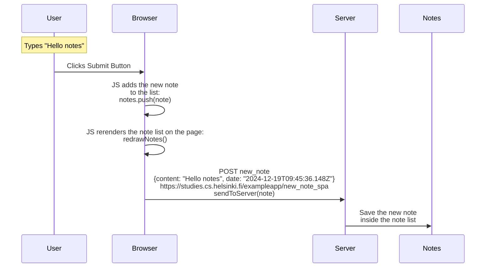

```mermaid
sequenceDiagram
    participant U as User
    participant B as Browser
    participant S as Server
    participant N as Notes

      Note over U: Types "Hello notes"
    U->>B: Clicks Submit Button
    B->>B:JS adds the new note<br/>to the list:<br/>notes.push(note)
    B->>B:JS rerenders the note list on the page:<br/>redrawNotes()
    B->>S: POST new_note <br/>{content: "Hello notes", date: "2024-12-19T09:45:36.148Z"}<br/>https://studies.cs.helsinki.fi/exampleapp/new_note_spa<br/>sendToServer(note)
    S->>N:  Save the new note<br/>inside the note list

```
