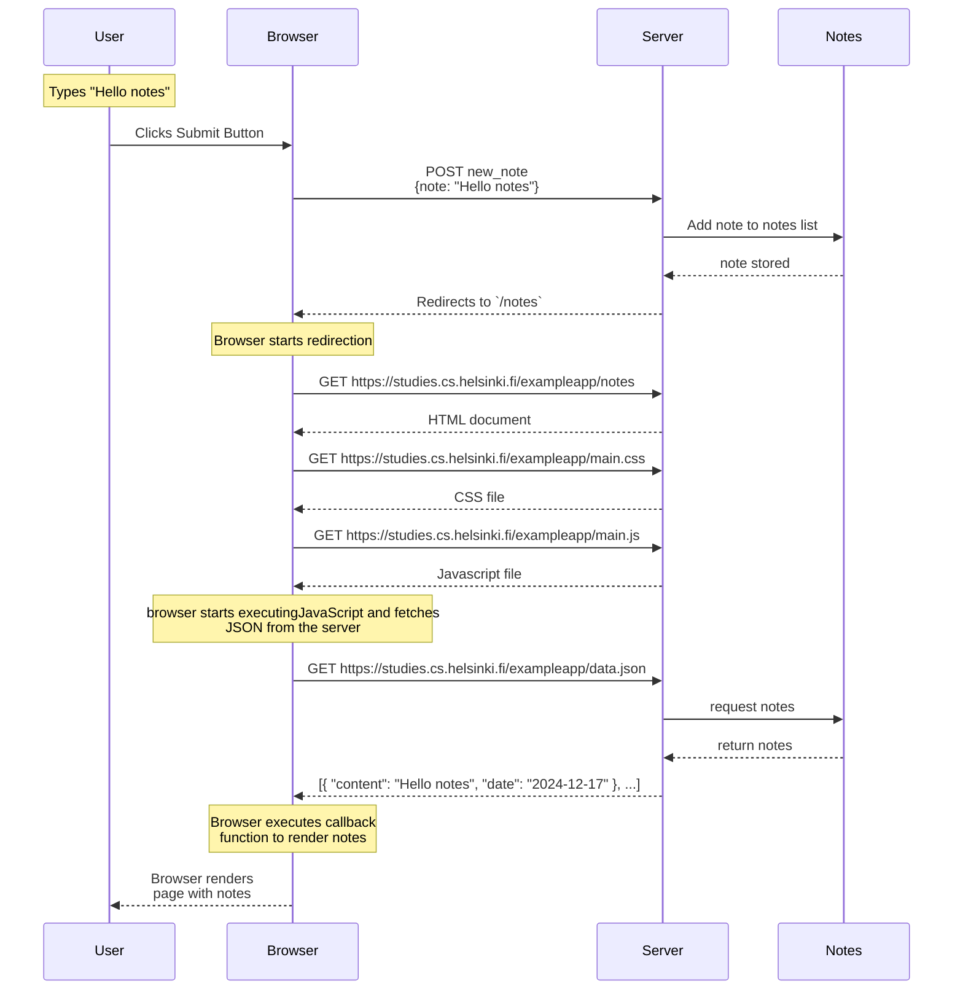

```mermaid
sequenceDiagram
    participant U as User
    participant B as Browser
    participant S as Server
    participant N as Notes

    Note over U: Types "Hello notes"
    U->>B: Clicks Submit Button
    B->>S: POST new_note <br/>{note: "Hello notes"}
    S->>N: Add note to notes list
    N-->>S:note stored
    S-->>B:Redirects to `/notes`

    Note over B:Browser starts redirection

    B->>S: GET https://studies.cs.helsinki.fi/exampleapp/notes
    S-->>B: HTML document
    B->>S:GET https://studies.cs.helsinki.fi/exampleapp/main.css
    S-->>B: CSS file
    B->>S:GET https://studies.cs.helsinki.fi/exampleapp/main.js
    S-->>B: Javascript file


    Note over B:browser starts executingJavaScript and fetches<br/>JSON from the server

        B->>S:GET https://studies.cs.helsinki.fi/exampleapp/data.json
        S->>N: request notes
        N-->>S: return notes
        S-->>B: [{ "content": "Hello notes", "date": "2024-12-17" }, ...]

    Note over B: Browser executes callback<br/>function to render notes

    B-->>U:Browser renders<br/>page with notes
```
